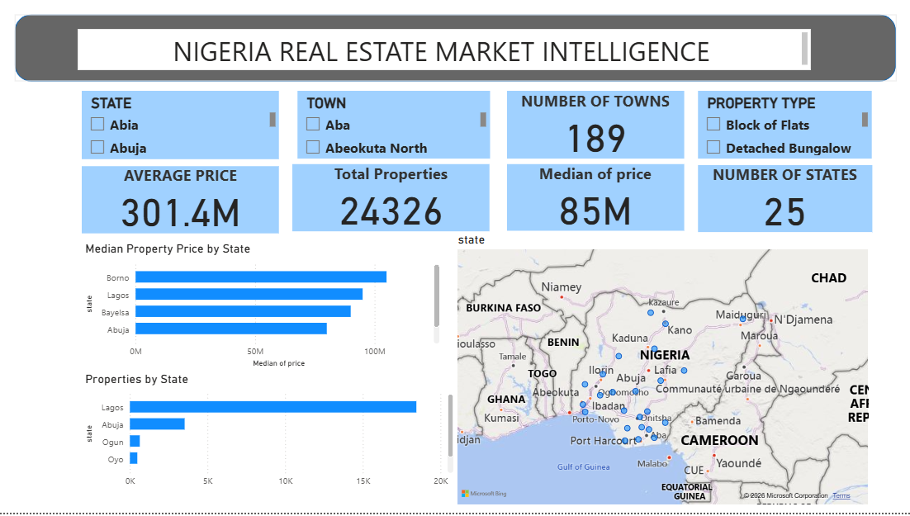
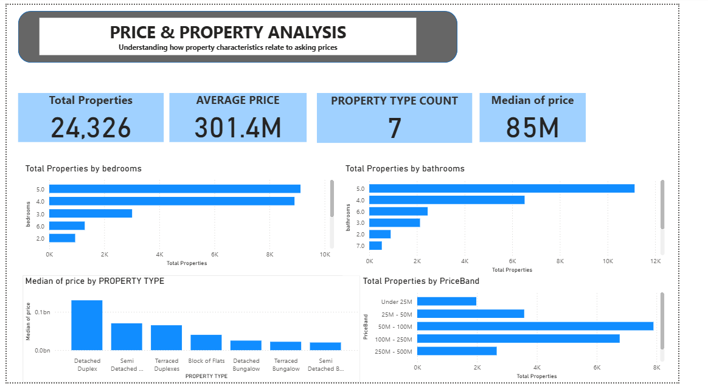
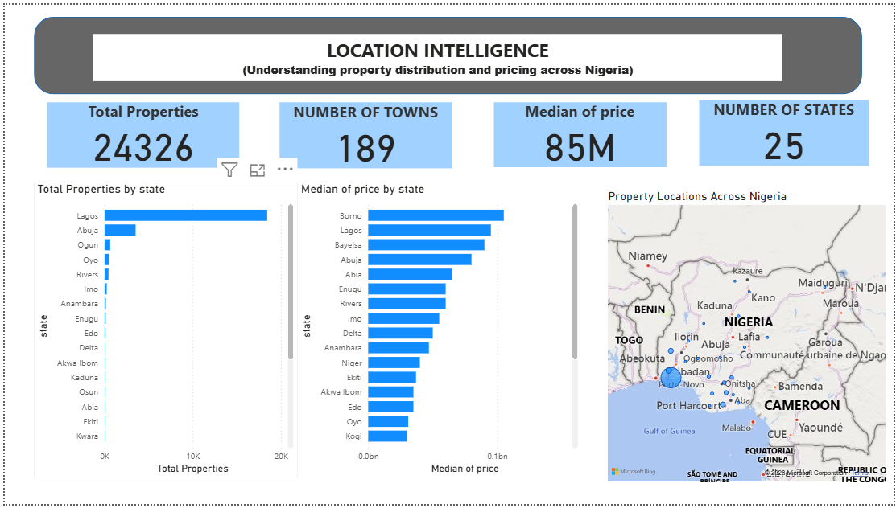
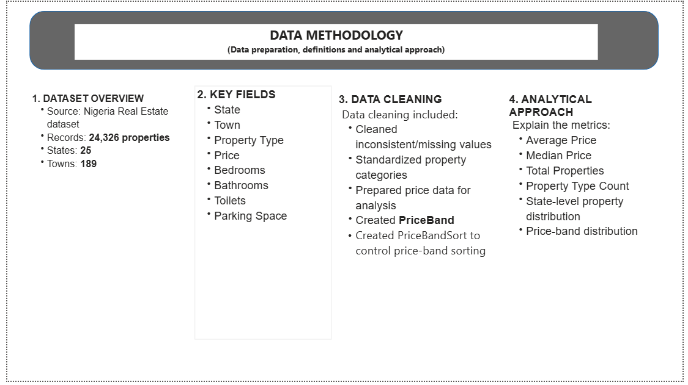

# Nigeria Real Estate Market Analysis

## Project Overview

This project analyzes property listings across Nigeria to understand property prices, property characteristics, and geographical distribution.

The analysis was developed using Power BI to transform a real estate dataset into an interactive dashboard that provides useful insights for property buyers, sellers, investors, and other stakeholders.

## Business Problem

The objective of this analysis is to answer key questions such as:

- What is the average and median property price?
- Which states have the highest property prices?
- Which states have the highest number of property listings?
- How are properties distributed across different price bands?
- How do property types relate to asking prices?
- What property characteristics are common across the dataset?
- How does property availability vary across locations?

## Data & Methodology

### Dataset Overview

- **Source:** Nigeria Real Estate dataset
- **Records:** 24,326 properties
- **States:** 25
- **Towns:** 189

### Key Fields

- State
- Town
- Property Type
- Price
- Bedrooms
- Bathrooms
- Toilets
- Parking Space

### Data Preparation

The dataset was prepared using Power Query and Power BI.

Key preparation steps included:

- Cleaning inconsistent and missing values
- Standardizing property categories
- Preparing price data for analysis
- Creating price bands
- Creating a PriceBandSort column to ensure correct price-band ordering

## Key Insights

The dashboard provides insights into:

- Property price distribution across Nigeria
- Property availability by state
- Median property price by state
- Property distribution by bedrooms and bathrooms
- Property type and price relationships
- Distribution of properties across different price bands

### Important Finding

The analysis shows that **Borno has the highest median property price among the states represented in the dataset**.

This should be interpreted as the **highest median asking price in this dataset**, rather than meaning that Borno necessarily has the single most expensive property in Nigeria.

## Recommendations

### For Property Buyers

Buyers can use location and price-band insights to compare markets and identify areas that fit their budgets.

### For Sellers

Sellers can use property type, location, and price insights to better understand the asking-price landscape in their market.

### For Investors

Investors can use state-level property distribution and pricing patterns to identify markets that may require further investigation.

### For Other Stakeholders

Real estate professionals can use the dashboard to support market comparisons, pricing discussions, and location-based decision-making.

## Tools & Skills

- Power BI
- Power Query
- DAX
- Data Cleaning
- Data Transformation
- Data Visualization
- Exploratory Data Analysis
- Business Intelligence
- Analytical Thinking

## Dashboard Pages

The Power BI project contains the following analytical pages:

1. **Project Overview**
2. **Price & Property Analysis**
3. **Location Intelligence**
4. **Data Methodology**

## Dashboard Preview

### Executive Overview

### Price & Property Analysis

### Location Intelligence

### Data Methodology

## Conclusion

This project demonstrates how raw real estate data can be transformed into an interactive business intelligence solution that communicates market patterns and supports data-driven decision-making.
